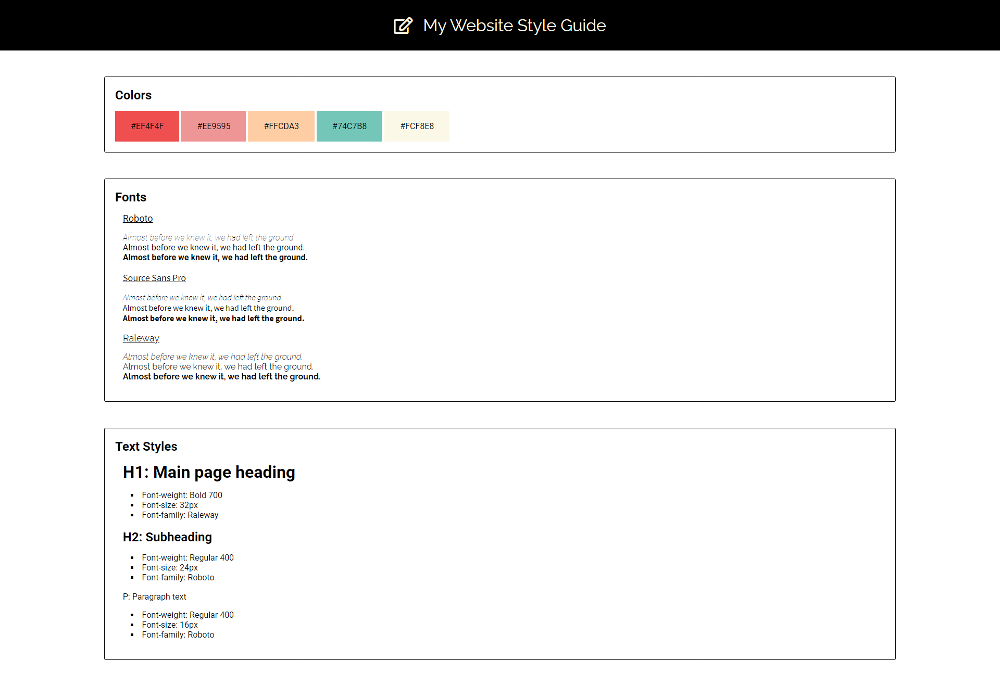

# My-Website-Style-Guide

This project is that I build my own basic design system for a website.  
I collect colors, fonts and some of the repaeting styles.   
This is just a prototype and can be updated anytime.  

 
